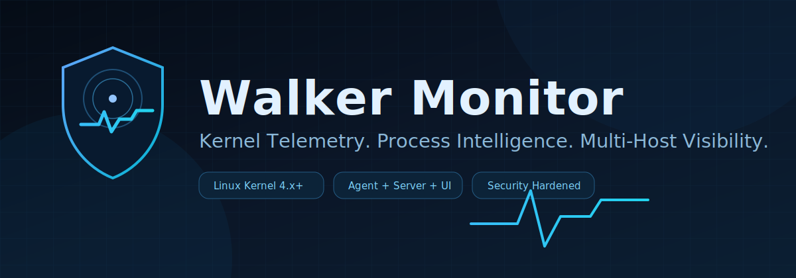
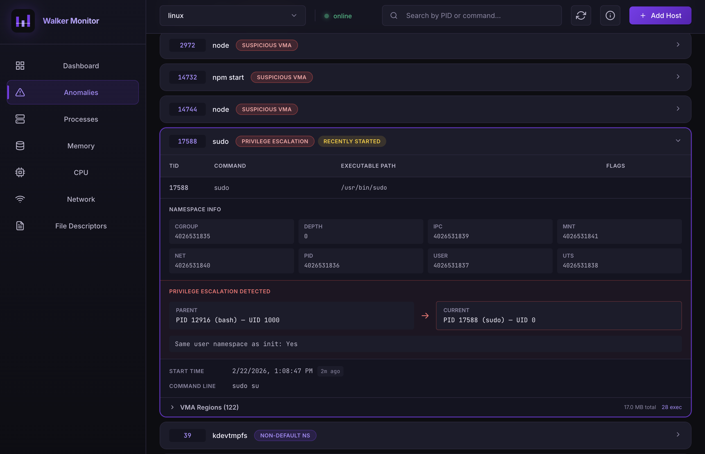
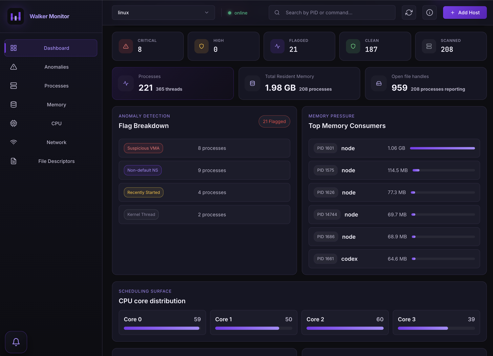

# Walker Monitor

<p align="center">
  
</p>

<p align="center">
  
  
  
</p>

<p align="center">
  
  
  
</p>

Walker Monitor is a Linux process-monitoring stack built from four parts:
- `system/`: kernel module + userspace walker binary
- `agent/`: per-host Flask API that executes walker and returns JSON
- `server/`: central Node/Express API that manages hosts and proxies agent data
- `web/`: React dashboard served by the server

This README is a clean install + run guide with all dependencies included.

## Architecture

```text
Monitored Host(s)
  task_walker kernel module + /dev/task_walker
  walker binary (system/walker)
  agent (Flask, default :5000)
         |
         v
Central Server (Node/Express, default :3000)
  - host registry
  - health checks
  - serves web/dist
         |
         v
Browser UI
```

## Supported Environment

- Linux (kernel 6.x+; requires modern headers/API support, tested on Ubuntu/Debian)
- Root/sudo access (required for module load/unload)
- Node.js 20+
- Python 3.8+

## Clone Repository

```bash
git clone <your-repo-url> walker-monitor
cd walker-monitor
```

## Installation Options

Choose either automatic or manual installation.

### Option A: Automatic Install (Scripts)

Use this if you want one-command setup per host role.

#### Agent host bootstrap (system + agent)

```bash
chmod +x agent/install.sh
./agent/install.sh
```

`agent/install.sh`:
- installs Ubuntu/Debian packages for kernel build + Python
- builds `system/task_walker.ko` and `system/walker`
- loads `task_walker` using `system/load.sh`
- creates/reuses `agent/venv`
- upgrades `pip` and installs `agent/requirements.txt`

Optional flags:

```bash
./agent/install.sh --no-system-deps
./agent/install.sh --no-build-system
./agent/install.sh --no-load-module
```

#### Server + web host bootstrap

```bash
chmod +x web/install.sh
./web/install.sh
```

`web/install.sh`:
- installs Ubuntu/Debian packages required for Node setup
- installs Node.js 20.x automatically if needed
- installs `server/` npm dependencies
- installs `web/` npm dependencies
- builds web assets (`npm run build`)

Optional flags:

```bash
./web/install.sh --no-system-deps --no-node-setup
./web/install.sh --no-server --no-build
```

### Option B: Manual Install (Step-by-step)

Use this if you want full control over each command.

#### 1) Install system packages (Ubuntu/Debian)

```bash
sudo apt update
sudo apt install -y \
  git curl ca-certificates jq \
  build-essential gcc make \
  linux-headers-$(uname -r) \
  python3 python3-venv python3-pip
```

#### 2) Install Node.js 20+

```bash
curl -fsSL https://deb.nodesource.com/setup_20.x | sudo -E bash -
sudo apt install -y nodejs
```

#### 3) Build and load walker components

```bash
cd system
make clean
make
gcc -Wall walker.c -o walker
sudo ./load.sh task_walker
cd ..
```

#### 4) Install agent dependencies

```bash
cd agent
python3 -m venv venv
source venv/bin/activate
python -m pip install --upgrade pip
pip install -r requirements.txt
cd ..
```

#### 5) Install server dependencies

```bash
cd server
npm install
cd ..
```

#### 6) Install web dependencies and build

```bash
cd web
npm install
npm run build
cd ..
```

## Verify Install

```bash
python3 --version
node --version
npm --version
gcc --version
ls -ld /lib/modules/$(uname -r)/build
ls -la /dev/task_walker
```

If `/lib/modules/$(uname -r)/build` does not exist, install matching kernel headers and rerun `./agent/install.sh`.

## Start the System

Run agent and server in separate terminals.

### Terminal A: Start Agent

```bash
cd /path/to/walker-monitor/agent
source venv/bin/activate

# Option A (recommended): enable API-key auth with environment variable
# export AGENT_API_KEY="change-me"

python agent.py
```

Option B: set API key directly in `agent/config.py`:

```python
STATIC_API_KEY = "change-me"
```

`AGENT_API_KEY` environment variable overrides `STATIC_API_KEY` if both are set.

Agent config env vars:
- `AGENT_HOST` (default: `0.0.0.0`)
- `AGENT_PORT` (default: `5000`)
- `AGENT_DEBUG` (default: `false`)
- `AGENT_API_KEY` (optional; if set, bearer auth is required)

### Terminal B: Start Server

```bash
cd /path/to/walker-monitor/server
npm start
```

Server env vars:
- `PORT` (default: `3000`)
- `AGENT_FETCH_TIMEOUT_MS` (default: `10000`)
- `ALLOW_LOOPBACK_AGENT` (default: `false`)
- `ALLOW_LINK_LOCAL_AGENT` (default: `false`)

## Open Dashboard

- Production (served by server): `http://localhost:3000`
- Vite dev mode (optional):
  ```bash
  cd web
  npm run dev
  ```
  then open `http://localhost:5173`

## Add Management Panel Screenshots

Place screenshot files in `docs/screenshots/` and reference them with relative paths in `README.md`.

Use these exact filenames:

```bash
mkdir -p docs/screenshots
# Copy your panel images:
# cp ~/Pictures/panel-anomalies.png docs/screenshots/panel-anomalies.png
# cp ~/Pictures/panel-dashboard.png docs/screenshots/panel-dashboard.png
```

Embedded preview in README:

```md
### Management Panel - Anomalies


### Management Panel - Dashboard

```

If you want fixed width in README:

```html

```

### Management Panel - Anomalies


### Management Panel - Dashboard


## Add a Host Correctly

Use a routable host IP, not `localhost`.

1. On the agent host, get IP:
   ```bash
   hostname -I | awk '{print $1}'
   ```
2. In the UI, add host URL as:
   - `http://<agent-ip>:5000`
3. If `AGENT_API_KEY` was set on the agent, provide the same key in the host API key field.

Notes:
- Loopback URLs (`localhost`, `127.0.0.1`, `::1`) are blocked by default on the server.
- Link-local addresses are also blocked by default.

## Quick API Checks

### Agent

```bash
# No auth
curl http://<agent-ip>:5000/health

# With auth
curl -H "Authorization: Bearer $AGENT_API_KEY" http://<agent-ip>:5000/health

curl -H "Authorization: Bearer $AGENT_API_KEY" http://<agent-ip>:5000/snapshot | jq
curl -H "Authorization: Bearer $AGENT_API_KEY" http://<agent-ip>:5000/fdt | jq
curl -H "Authorization: Bearer $AGENT_API_KEY" http://<agent-ip>:5000/cpu | jq
curl -H "Authorization: Bearer $AGENT_API_KEY" http://<agent-ip>:5000/network | jq
curl -H "Authorization: Bearer $AGENT_API_KEY" http://<agent-ip>:5000/memory | jq
curl -H "Authorization: Bearer $AGENT_API_KEY" http://<agent-ip>:5000/anomalies | jq
```

### Server

```bash
curl http://localhost:3000/api/hosts | jq

curl -X POST http://localhost:3000/api/hosts \
  -H "Content-Type: application/json" \
  -d '{"name":"host-a","url":"http://<agent-ip>:5000","apiKey":"'"$AGENT_API_KEY"'"}' | jq

curl http://localhost:3000/api/hosts/host-a/snapshot | jq '.processes | length'
```

## Troubleshooting

### `Can't open device file: /dev/task_walker`

```bash
cd system
sudo ./load.sh task_walker
ls -la /dev/task_walker
```

### Module build fails with missing headers

Install matching headers:

```bash
sudo apt install -y linux-headers-$(uname -r)
```

### Agent returns `{"error":"Unauthorized"}`

Set bearer header on every request:

```bash
curl -H "Authorization: Bearer $AGENT_API_KEY" http://<agent-ip>:5000/health
```

### Server rejects host URL

Common causes:
- loopback/link-local URL blocked by default
- URL includes path/query/fragment

Use only plain origin format:
- `http://192.168.x.x:5000`

### Web shows host offline

- Verify agent is running and reachable from server host
- Verify API key matches (if enabled)
- Verify server host entry uses non-loopback routable IP

## Project Layout

```text
walker-monitor/
├── system/
│   ├── task_walker.c
│   ├── task_walker.h
│   ├── walker.c
│   ├── Makefile
│   ├── load.sh
│   └── unload.sh
├── agent/
│   ├── agent.py
│   ├── config.py
│   ├── install.sh
│   ├── requirements.txt
│   └── start.sh
├── server/
│   ├── server.js
│   └── package.json
├── web/
│   ├── src/
│   ├── install.sh
│   ├── vite.config.js
│   └── package.json
├── docs/
│   ├── walker-banner.svg
│   ├── screenshots/
│   └── ASSETS_LICENSE.md
└── README.md
```

## Notes

- Server host registry is in-memory (not persisted across server restart).
- Data refresh is user-triggered from the UI.
- Kernel module and walker output format drive all downstream parsing.

## License

| Scope | License | Tag |
|---|---|---|
| `system/` kernel/module components | GPL-2.0 |  |
| Agent + Server + Web application code | MIT |  |
| Logo and README artwork (`web/public/walker-logo.svg`, `docs/walker-banner.svg`) | CC BY 4.0 |  |

See `docs/ASSETS_LICENSE.md` for visual asset attribution details.
